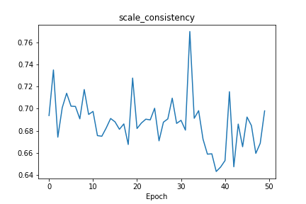

# Discriminator (critic) and generator losses

# Metrics

- **Empty Beat Rate** 
The empty-beat rate is defined as the ratio of the number of empty beats (where no note is played) to the total number of beats. 
 

- **Empty Beat Rate** 
Ratio of empty measures. 
 

- **Groove Consistency** 
Ratio of empty measures. 
$groove\_consistency = 1 - \frac{1}{T - 1} \sum_{i = 1}^{T - 1}{d(G_i, G_{i + 1})}$  
Here, $T$ is the number of measures $G_i$,  is the binary onset vector of the -th measure (a one at position that has an onset, otherwise a zero), and $d(G,G')$  is the hamming distance between two vectors $G$ and $G'$. Note that this metric only works for songs with a constant time signature. 
 

- **N Pitches Used** 
Unique pitches used. 
 

- **Pitch Class Entropy** 
Entropy of the normalized note pitch class histogram.
The pitch class entropy is defined as the Shannon entropy of the normalized note pitch class histogram. 
$pitch\_class\_entropy = -\sum_{i = 0}^{11}{
    P(pitch\_class=i) \times \log_2 P(pitch\_class=i)}$ 
 

- **Pitch Entropy** 
Entropy of the normalized pitch histogram. 
 

- **Pitch Range** 
Pitch range. 
 

- **Polyphony** 
Average number of pitches being played concurrently.
The polyphony is defined as the average number of pitches being played at the same time, evaluated only at time steps where at least one pitch is on. 
$polyphony = \frac{
    \#(pitches\_when\_at\_least\_one\_pitch\_is\_on)
}{
    \#(time\_steps\_where\_at\_least\_one\_pitch\_is\_on)
}$  
 

- **Polyphony Rate** 
Ratio of time steps where multiple pitches are on.
The polyphony rate is defined as the ratio of the number of time steps where multiple pitches are on to the total number of time steps. 
$polyphony\_rate = \frac{
    \#(time\_steps\_where\_multiple\_pitches\_are\_on)
}{
    \#(time\_steps)
}$ 
 

- **Scale Consistency** 
The largest pitch-in-scale rate.
The scale consistency is defined as the largest pitch-in-scale rate over all major and minor scales. 
$scale\_consistency = \max_{root, mode}{
    pitch\_in\_scale\_rate(root, mode)}$ 
 